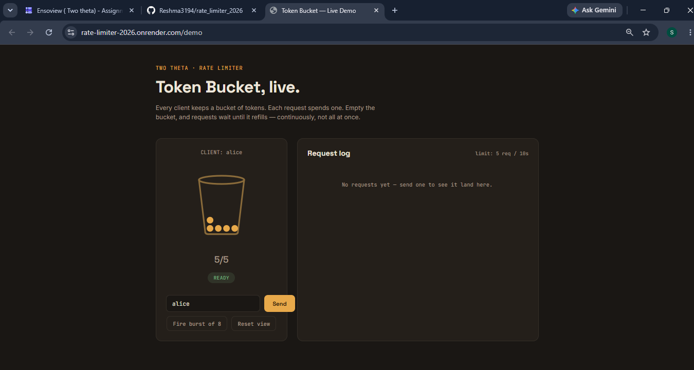

# Rate Limiter — Two Theta Take-Home

 &nbsp;  &nbsp;  &nbsp;  &nbsp; 

🚀 **Live demo:** [rate-limiter-2026.onrender.com/demo](https://rate-limiter-2026.onrender.com/demo)



A per-client rate limiter built with the **Token Bucket** algorithm, exposed via a FastAPI HTTP endpoint.

## Algorithm: Token Bucket — why?

Each client has a bucket holding up to `N` tokens. Tokens refill continuously
at `N / T` tokens per second. Every request costs 1 token; if none are left,
the request is blocked.

**Why this over fixed window / sliding window log / leaky bucket:**
- **No edge-burst problem.** Fixed window counters reset sharply at window
  boundaries, so a client can send N requests at 0:09 and N more at 0:10 and
  get 2N requests in ~1 second. Token bucket refills smoothly, so this can't happen.
- **Allows legitimate bursts.** A client that's been idle can use its full
  bucket in one burst — this matches how real clients behave (e.g. a page
  load firing several API calls at once) better than a leaky bucket, which
  enforces a strictly constant output rate.
- **O(1) memory per client** — just `(tokens, last_refill_timestamp)`, unlike
  a sliding window log which stores every request timestamp.
- **Trade-off:** it's an approximation of "N per T", not an exact sliding
  window count. In rare cases the *effective* rate over an arbitrary window
  can be up to ~2x N right after a long idle period, because a full bucket
  can be spent immediately. For this assignment's use case (per-client API
  protection) that trade-off is acceptable and standard (this is what AWS,
  Stripe, and most production API gateways use).

## Design

- **Client identification:** `client_id` query param if provided, else the
  caller's IP address. This keeps the demo flexible (test multiple clients
  with one server) while still having a sane real-world default.
- **Decision function:** `TokenBucketLimiter.allow(client_id) -> dict` returns
  `allowed`, `remaining`, `retry_after`, `limit`, `period_seconds`.
- **Concurrency:** a single `threading.Lock` guards bucket read-modify-write.
  Under FastAPI's default sync threadpool, multiple requests for the same
  client can arrive on different threads simultaneously; without the lock,
  two threads could both read "1 token left" and both decrement, letting
  N+1 requests through (a classic race / TOCTOU bug). The lock makes each
  `allow()` call atomic. Tested explicitly in
  `test_concurrent_requests_same_client_edge_case` (20 threads firing at once
  against a capacity-5 bucket; exactly 5 are allowed).
  - At larger scale (multiple server processes/instances), a single in-memory
    lock isn't enough — you'd need a shared store (Redis with `INCR`/Lua
    script, or `MULTI/EXEC`) so all instances see the same bucket state.

## Assumptions

- Single-process deployment for this demo (in-memory state). Documented above
  how this would change for multi-instance deployment (Redis-backed).
- Buckets are created lazily on first request per client, starting full.
- No persistence — restarting the server resets everyone's quota. Fine for a
  demo; a real system would likely back this with Redis for durability across
  restarts/instances anyway.

## Edge cases considered

1. **Concurrent requests for the same client** (see Concurrency above) — handled
   with a lock, tested with 20 concurrent threads.
2. **One client exhausting their quota must not affect another client** —
   each client has an independent bucket; tested in
   `test_per_client_isolation_edge_case`.
3. **Bucket refilling correctly over time** (not just resetting all-or-nothing)
   — tokens are refilled proportionally to elapsed time on every call, not on
   a timer, so there's no background thread needed and no drift.

## Sample scenario walkthrough (from the assignment)

Config: 5 requests / 10 seconds, per client "alice".

- Alice sends 8 requests in the first 3 seconds:
  - Requests 1–5: **allowed** (bucket starts full at 5 tokens)
  - Requests 6–8: **blocked** (429, with `Retry-After` telling her roughly
    how many seconds until the next token is available — since refill rate
    is 0.5 tokens/sec, roughly 2s, 4s, 6s after request 5, respectively)
- Alice waits 10 seconds (a full period) → bucket is back to full (5 tokens),
  since 10s × 0.5 tokens/sec = 5 tokens, capped at capacity.
- Alice sends 2 more requests → both **allowed** (3 tokens remain).

## What I'd do differently with more time

- Back the limiter with **Redis** (`INCR` + `EXPIRE` or a Lua script for
  atomicity) so it works correctly across multiple server instances, not
  just one process.
- Add a `X-RateLimit-Reset` header (Unix timestamp of next full refill) in
  addition to `Retry-After`.
- Make the limiter config (N, T) per-route or per-API-key instead of global,
  since real systems often have different limits for different endpoints/tiers.
- Add a lightweight admin/metrics endpoint (requests allowed vs blocked, per
  client) for observability.
- Load-test with a real concurrency tool (e.g. `locust` or `wrk`) instead of
  just an in-process thread test, to validate behavior under real network
  concurrency, not just threading within one process.

## Running locally

```bash
pip install -r requirements.txt
uvicorn app.main:app --reload --port 8000
```

Then:
```bash
curl "http://localhost:8000/request?client_id=alice"
```

Fire 6 requests quickly to see the 6th get blocked (429):
```bash
for i in 1 2 3 4 5 6; do curl -i "http://localhost:8000/request?client_id=alice"; echo; done
```

Configure the limit via env vars:
```bash
RATE_LIMIT_CAPACITY=10 RATE_LIMIT_PERIOD=60 uvicorn app.main:app --port 8000
```

## Running tests

```bash
pytest tests/ -v
```

All 5 tests pass:
- `test_allowed_under_limit`
- `test_blocked_over_limit`
- `test_bucket_refills_over_time`
- `test_per_client_isolation_edge_case`
- `test_concurrent_requests_same_client_edge_case`
